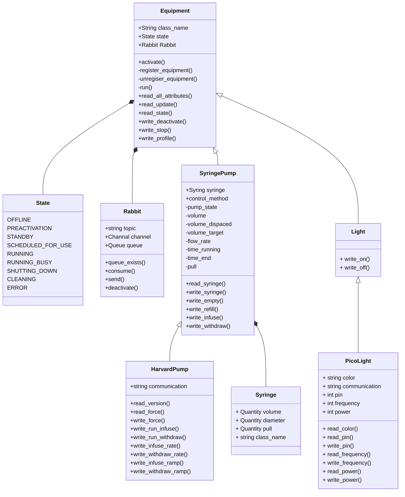

# Equipment Overview

Every piece of equipment has three types of methods:
* activate
  * Only one method per equipment and is called to start the piece of equipment
  * Starts the infinite loop
  * Starts listening for RabbitMQ messages
* write_
  * Cause a change in value; or does an action
* read_
  * Returns value or data
  * Does not cause any changes in state or actions

Equipment.attrs should be updated with attributes in subclasses.

