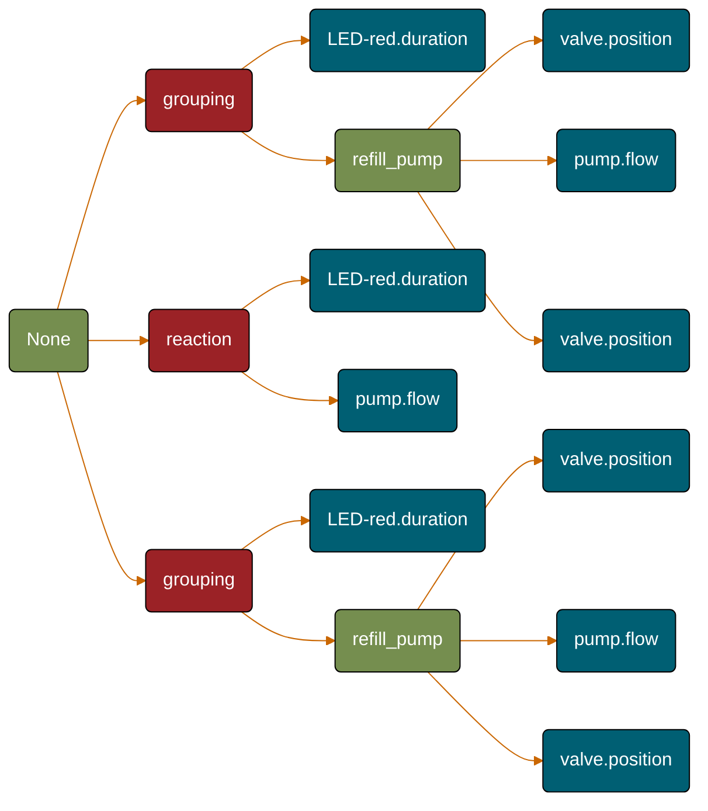
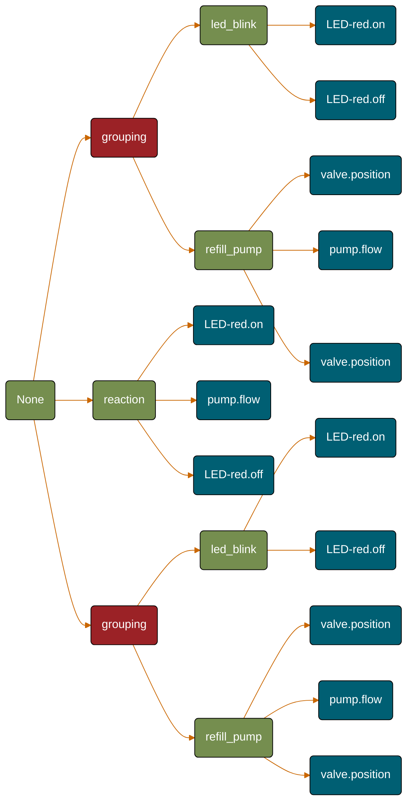
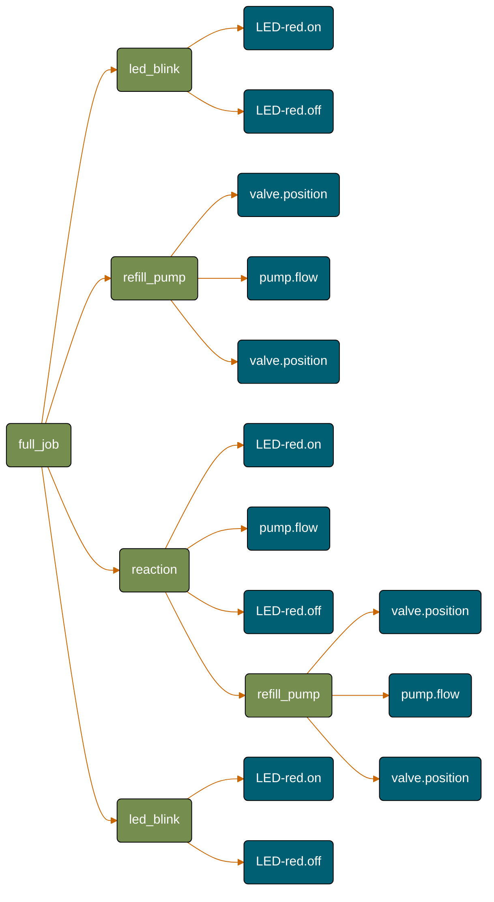
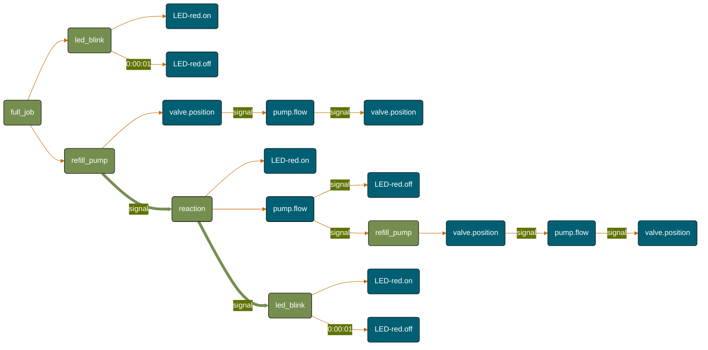

```mermaid
%%{
	init: {
		'theme': 'base',
		'themeVariables': {
			'background': '#404e4d',
			'fontFamily': 'arial',
			'primaryColor': '#005f73',
			'primaryTextColor': '#ffffff',
			'primaryBorderColor': '#000000',
			'lineColor': '#ca6702',
			'tertiaryColor': '#fdf0d5',
			'tertiaryTextColor': '#000000'
		}
	}
}%%
graph LR;
	0(full_job):::job_sequence --> 1(grouping):::job_concurrent;
	1(grouping) --> 2(LED-red.duration):::event;
	1(grouping) --> 3(refill_pump):::job_sequence;
	3(refill_pump) --> 4(valve.position):::event;
	3(refill_pump) --> 5(pump.flow):::event;
	3(refill_pump) --> 6(valve.position):::event;
	0(None) --> 7(reaction):::job_concurrent;
	7(reaction) --> 8(LED-red.duration):::event;
	7(reaction) --> 9(pump.flow):::event;
	0(None) --> 10(grouping):::job_concurrent;
	10(grouping) --> 11(LED-red.duration):::event;
	10(grouping) --> 12(refill_pump):::job_sequence;
	12(refill_pump) --> 13(valve.position):::event;
	12(refill_pump) --> 14(pump.flow):::event;
	12(refill_pump) --> 15(valve.position):::event;


	classDef job_sequence fill:#758E4F
	classDef job_concurrent fill:#9b2226
	classDef event fill:#005f73
```

```mermaid
%%{
	init: {
		'theme': 'base',
		'themeVariables': {
			'background': '#404e4d',
			'fontFamily': 'arial',
			'primaryColor': '#005f73',
			'primaryTextColor': '#ffffff',
			'primaryBorderColor': '#000000',
			'lineColor': '#ca6702',
			'tertiaryColor': '#fdf0d5',
			'tertiaryTextColor': '#000000'
		}
	}
}%%
graph LR;
	0(None):::job_sequence --> 1(grouping):::job_concurrent;
	1(grouping) --> 2(led_blink):::job_sequence;
	2(led_blink) --> 3(LED-red.on):::event;
	2(led_blink) --> 4(LED-red.off):::event;
	1(grouping) --> 5(refill_pump):::job_sequence;
	5(refill_pump) --> 6(valve.position):::event;
	5(refill_pump) --> 7(pump.flow):::event;
	5(refill_pump) --> 8(valve.position):::event;
	0(None) --> 9(reaction):::job_sequence;
	9(reaction) --> 10(LED-red.on):::event;
	9(reaction) --> 11(pump.flow):::event;
	9(reaction) --> 12(LED-red.off):::event;
	0(None) --> 13(grouping):::job_concurrent;
	13(grouping) --> 14(led_blink):::job_sequence;
	14(led_blink) --> 15(LED-red.on):::event;
	14(led_blink) --> 16(LED-red.off):::event;
	13(grouping) --> 17(refill_pump):::job_sequence;
	17(refill_pump) --> 18(valve.position):::event;
	17(refill_pump) --> 19(pump.flow):::event;
	17(refill_pump) --> 20(valve.position):::event;


	classDef job_sequence fill:#758E4F
	classDef job_concurrent fill:#9b2226
	classDef event fill:#005f73
```

# Old stuff

```mermaid
%%{
	init: {
		'theme': 'base',
		'themeVariables': {
			'background': '#404e4d',
			'fontFamily': 'arial',
			'primaryColor': '#005f73',
			'primaryTextColor': '#ffffff',
			'primaryBorderColor': '#000000',
			'lineColor': '#ca6702',
			'tertiaryColor': '#fdf0d5',
			'tertiaryTextColor': '#000000'
		}
	}
}%%
graph LR;
	0(full_job):::job --> 1(led_blink):::job;
	1(led_blink) --> 2(LED-red.on);
	1(led_blink) --> 3(LED-red.off);
	0(full_job) --> 4(refill_pump):::job;
	4(refill_pump) --> 5(valve.position);
	4(refill_pump) --> 6(pump.flow);
	4(refill_pump) --> 7(valve.position);
	0(full_job) --> 8(reaction):::job;
	8(reaction) --> 9(LED-red.on);
	8(reaction) --> 10(pump.flow);
	8(reaction) --> 11(LED-red.off);
	8(reaction) --> 12(refill_pump):::job;
	12(refill_pump) --> 13(valve.position);
	12(refill_pump) --> 14(pump.flow);
	12(refill_pump) --> 15(valve.position);
	0(full_job) --> 16(led_blink):::job;
	16(led_blink) --> 17(LED-red.on);
	16(led_blink) --> 18(LED-red.off);


	classDef job fill:#758E4F
	classDef event fill:#005f73
```

```mermaid
%%{
	init: {
		'theme': 'base',
		'themeVariables': {
			'background': '#404e4d',
			'fontFamily': 'arial',
			'primaryColor': '#005f73',
			'primaryTextColor': '#ffffff',
			'primaryBorderColor': '#000000',
			'lineColor': '#ca6702',
			'tertiaryColor': '#fdf0d5',
			'tertiaryTextColor': '#000000'
		}
	}
}%%
graph LR;
	0(full_job):::job --> 1(led_blink):::job;
	1(led_blink) --> 2(LED-red.on);
	1(led_blink) -- 0:00:01 --> 3(LED-red.off);
	0(full_job) --> 4(refill_pump):::job;
	4(refill_pump) --> 5(valve.position);
	5(valve.position) -- signal --> 6(pump.flow);
	6(pump.flow) -- signal --> 7(valve.position);
	4(refill_pump) -- signal --> 8(reaction):::job;
	8(reaction) --> 9(LED-red.on);
	8(reaction) --> 10(pump.flow);
	10(pump.flow) -- signal --> 11(LED-red.off);
	10(pump.flow) -- signal --> 12(refill_pump):::job;
	12(refill_pump) --> 13(valve.position);
	13(valve.position) -- signal --> 14(pump.flow);
	14(pump.flow) -- signal --> 15(valve.position);
	8(reaction) -- signal --> 16(led_blink):::job;
	16(led_blink) --> 17(LED-red.on);
	16(led_blink) -- 0:00:01 --> 18(LED-red.off);

	linkStyle 7 stroke:#758E4F,stroke-width:6px;
	linkStyle 15 stroke:#758E4F,stroke-width:6px;

	classDef job fill:#758E4F
	classDef event fill:#005f73
```
