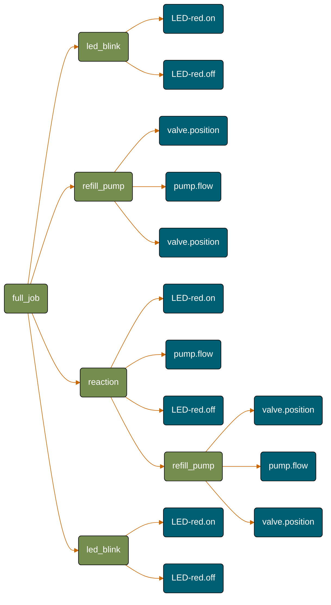
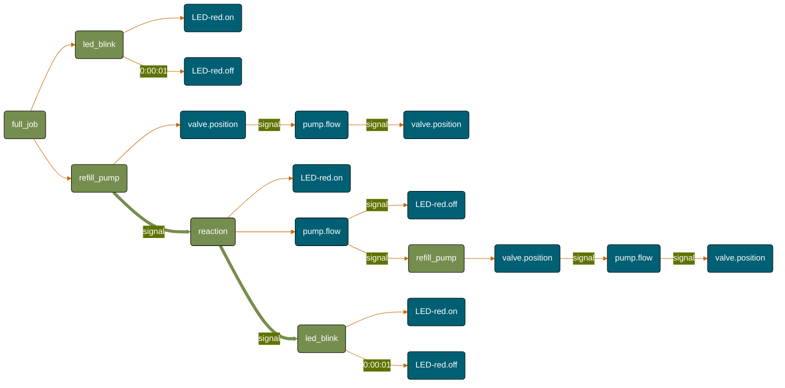

```mermaid
%%{
	init: {
		'theme': 'base',
		'themeVariables': {
			'background': '#404e4d',
			'fontFamily': 'arial',
			'primaryColor': '#005f73',
			'primaryTextColor': '#ffffff',
			'primaryBorderColor': '#000000',
			'lineColor': '#ca6702',
			'tertiaryColor': '#fdf0d5',
			'tertiaryTextColor': '#000000'
		}
	}
}%%
graph LR;
	0(full_job):::job --> 1(led_blink):::job;
	1(led_blink) --> 2(LED-red.on);
	1(led_blink) --> 3(LED-red.off);
	0(full_job) --> 4(refill_pump):::job;
	4(refill_pump) --> 5(valve.position);
	4(refill_pump) --> 6(pump.flow);
	4(refill_pump) --> 7(valve.position);
	0(full_job) --> 8(reaction):::job;
	8(reaction) --> 9(LED-red.on);
	8(reaction) --> 10(pump.flow);
	8(reaction) --> 11(LED-red.off);
	8(reaction) --> 12(refill_pump):::job;
	12(refill_pump) --> 13(valve.position);
	12(refill_pump) --> 14(pump.flow);
	12(refill_pump) --> 15(valve.position);
	0(full_job) --> 16(led_blink):::job;
	16(led_blink) --> 17(LED-red.on);
	16(led_blink) --> 18(LED-red.off);


	classDef job fill:#758E4F
	classDef event fill:#005f73
```

```mermaid
%%{
	init: {
		'theme': 'base',
		'themeVariables': {
			'background': '#404e4d',
			'fontFamily': 'arial',
			'primaryColor': '#005f73',
			'primaryTextColor': '#ffffff',
			'primaryBorderColor': '#000000',
			'lineColor': '#ca6702',
			'tertiaryColor': '#fdf0d5',
			'tertiaryTextColor': '#000000'
		}
	}
}%%
graph LR;
	0(full_job):::job --> 1(led_blink):::job;
	1(led_blink) --> 2(LED-red.on);
	1(led_blink) -- 0:00:01 --> 3(LED-red.off);
	0(full_job) --> 4(refill_pump):::job;
	4(refill_pump) --> 5(valve.position);
	5(valve.position) -- signal --> 6(pump.flow);
	6(pump.flow) -- signal --> 7(valve.position);
	4(refill_pump) -- signal --> 8(reaction):::job;
	8(reaction) --> 9(LED-red.on);
	8(reaction) --> 10(pump.flow);
	10(pump.flow) -- signal --> 11(LED-red.off);
	10(pump.flow) -- signal --> 12(refill_pump):::job;
	12(refill_pump) --> 13(valve.position);
	13(valve.position) -- signal --> 14(pump.flow);
	14(pump.flow) -- signal --> 15(valve.position);
	8(reaction) -- signal --> 16(led_blink):::job;
	16(led_blink) --> 17(LED-red.on);
	16(led_blink) -- 0:00:01 --> 18(LED-red.off);

	linkStyle 7 stroke:#758E4F,stroke-width:6px;
	linkStyle 15 stroke:#758E4F,stroke-width:6px;

	classDef job fill:#758E4F
	classDef event fill:#005f73
```
