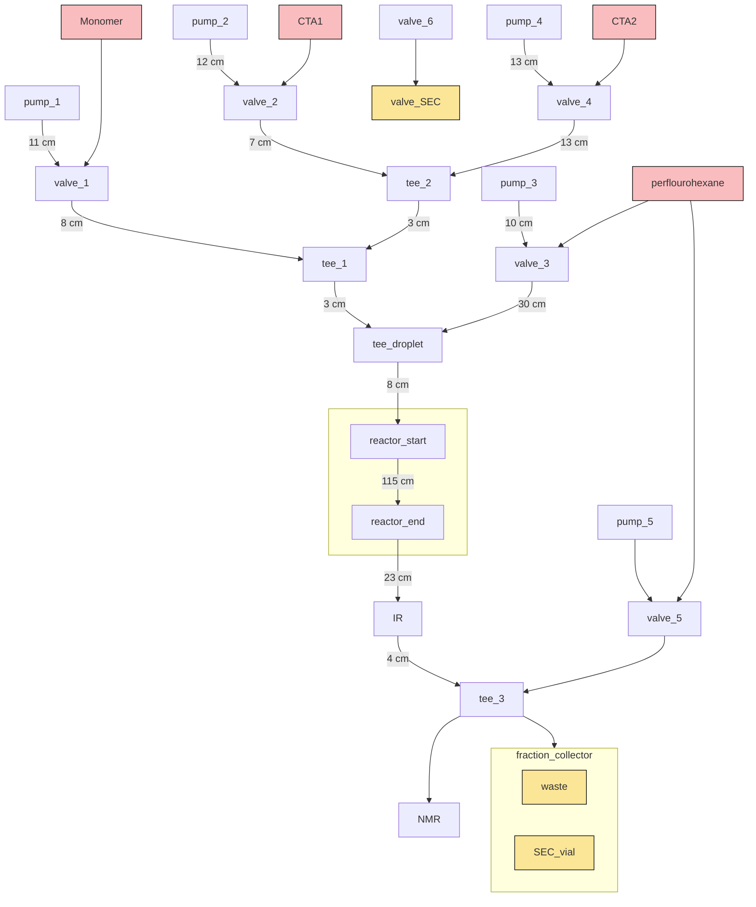

IR-11 perflourhex

21 min into linear transition the NMR had and error the whole thing had to be restarted. 

stop: 11:21:31.175
start
stop
start: 11:26:37.107

short stop at 23

## Error fixed; add enumerate to list comprehension

12-02 11:21:28.850 INFO     || nmr.nmr                   proton started: 2023-12-02 11:21:28.850409

12-02 11:21:31.175 ERROR    || nmr.nmr                   Issue on reply(inner)

12-02 11:21:31.175 ERROR    || nmr.nmr                   Traceback (most recent call last):
  File "C:\Users\Robot2\Desktop\Dylan\python\ChemBot\chembot\equipment\sensors\nmr\nmr.py", line 254, in take_protron
    messages = [message for i, message in messages if i % 2 == 1]
  File "C:\Users\Robot2\Desktop\Dylan\python\ChemBot\chembot\equipment\sensors\nmr\nmr.py", line 254, in <listcomp>
    messages = [message for i, message in messages if i % 2 == 1]
ValueError: not enough values to unpack (expected 2, got 0)

12-02 11:21:31.176 ERROR    || nmr.nmr                   <?xml version="1.0" encoding="utf-8"?>
<Message>
  <StatusNotification timestamp="11:21:49">
    <Progress protocol="1D EXTENDED+" percentage="100" secondsRemaining="0" />
  </StatusNotification>
</Message><?xml version="1.0" encoding="utf-8"?>
<Message>
  <StatusNotification timestamp="11:21:49">
    <Completed protocol="1D EXTENDED+" completed="true" successful="true" />
  </StatusNotification>
</Message>

NMR
1) 10:37:36.050  (100% mon)
2) 10:51:35.118
3) 10:58:20.068
4) 11:05:29.254
5) 11:13:03.468
6) 11:35:59.047
7) 11:51:59.958
8) 

SEC

1) 10:52:05.118
2) 10:59:07.557
3) 11:06:14.127
4) 11:14:15.828
5) 11:21:07.560
6) 11:37:06.486
7) 11:44:45.606
8) 11:53:07.295

---

Reset at 11:57:53.886
IR:236

NMR
1) 12:10:52.176
2) 12:22:33.397
3) 12:32:32.369
4) 12:42:28.834
5) 12:52:02.765
6) 13:01:36.724
7) 13:12:21.285
8) 13:21:47.077
9) 13:33:37.523 
---
10) 14:00:10.868
 
stop: 13:35:24.937
start: 13:45:04.004 

SEC
1) 12:12:22.037
2) 12:20:39.655
3) 12:27:55.456
4) 12:34:47.123
5) 12:40:36.468
6) 12:50:32.883
7) 12:58:51.976
8) 13:06:38.708
9) 13:15:02.695
10) 13:24:18.013
11) 13:34:37.523
---
12) 13:53:36.003
13) 

