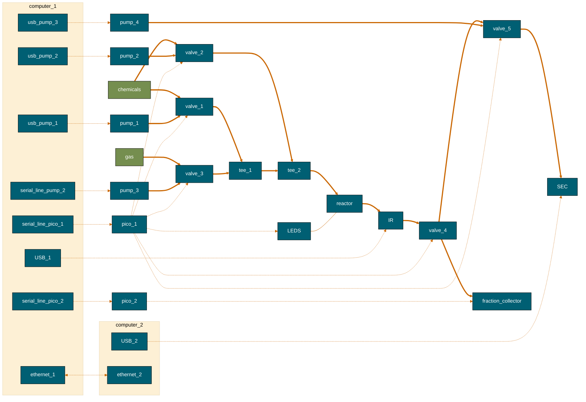
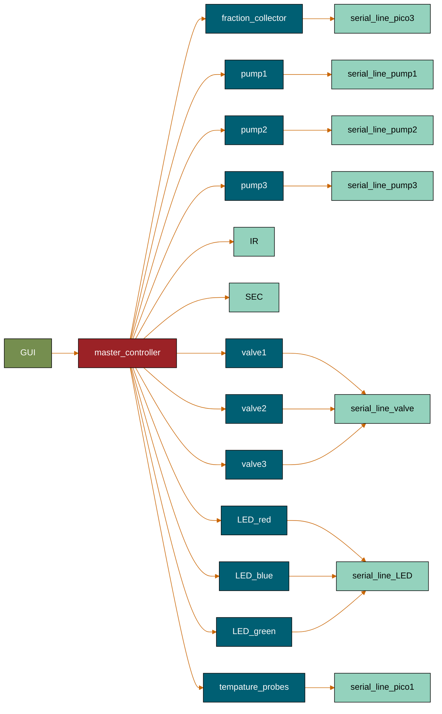
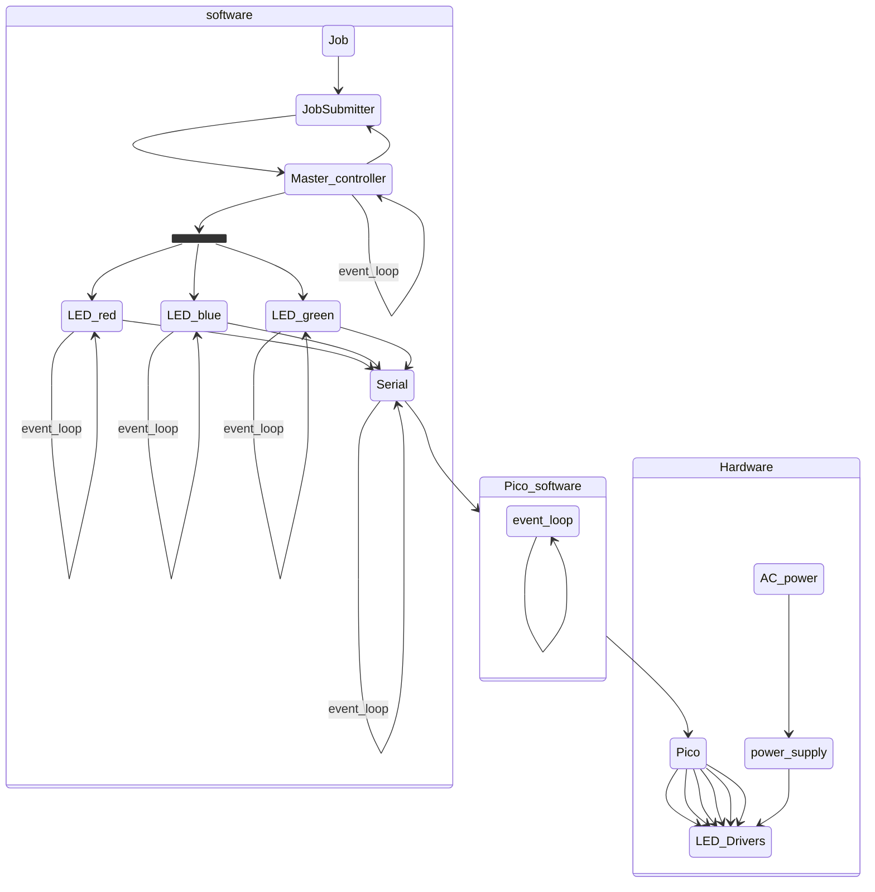
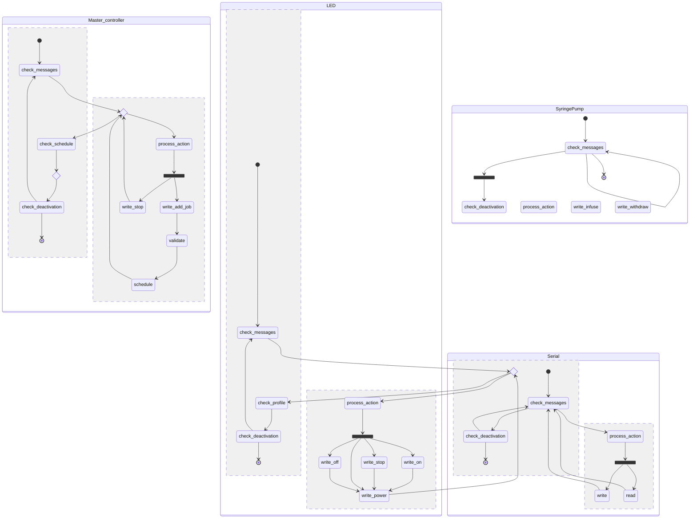
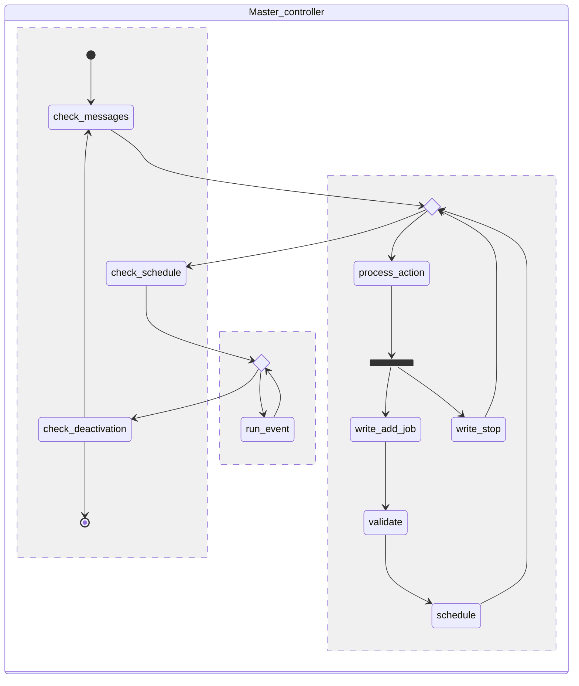

https://mermaid.js.org/config/theming.html

%%{
    init: {
    'theme':'base',
    'themeVariables': {
        'background': '#414C54',
        'fontFamily': 'arial',
        'primaryColor': '#33658A',
        'primaryTextColor': '#fff',
        'primaryBorderColor': '#000000',
        'lineColor': '#F6AE2D',
        'tertiaryColor': '#AFC5D5',
        'tertiaryTextColor': '#000000'
    }
    }
}%%

https://coolors.co/001219-005f73-0a9396-94d2bd-e9d8a6-ee9b00-ca6702-bb3e03-ae2012-9b2226  

```mermaid
%%{
    init: {
    'theme':'base',
    'themeVariables': {
        'background': '#404e4d',
        'fontFamily': 'arial',
        'primaryColor': '#005f73',
        'primaryTextColor': '#ffffff',
        'primaryBorderColor': '#000000',
        'lineColor': '#ca6702',
        'tertiaryColor': '#fdf0d5',
        'tertiaryTextColor': '#000000'
    }
    }
}%%
flowchart LR

    rabbitMQ:::rabbit    
    
    pump1 <--> rabbitMQ
    pump2 <--> rabbitMQ
    pump3 <--> rabbitMQ
    valve1 <--> rabbitMQ
    valve2 <--> rabbitMQ
    valve3 <--> rabbitMQ
    fraction_collector <--> rabbitMQ
    LEDS <--> rabbitMQ

    rabbitMQ <--> master_controller:::error 
    rabbitMQ <--> GUI:::GUI
    rabbitMQ <--> IR:::output
    rabbitMQ <--> SEC:::output
    rabbitMQ <--> serial_line_pump1:::output
    rabbitMQ <--> serial_line_pump2:::output 
    rabbitMQ <--> serial_line_pump3:::output 
    rabbitMQ <--> serial_line_LED:::output 
    rabbitMQ <--> serial_line_valves:::output 
    
    classDef rabbit fill:#001219
    classDef chem fill:#758E4F
    classDef GUI fill:#758E4F
    classDef error fill:#9b2226
    classDef output fill:#94d2bd,color:#000000
```

# LED job

stateDiagram-v2

    
    state Master_controller {
        [*] --> check_messages
        state if_state <<choice>>
        check_messages --> if_state
        if_state --> check_schedule
        check_schedule --> check_deactivation 
        check_deactivation --> check_messages
        check_deactivation --> [*]
        
        --
        if_state --> process_action
        state fork_state <<fork>>
            process_action --> fork_state
            fork_state --> write_add_job
            write_add_job --> validate
            validate --> schedule
            fork_state --> write_stop
            write_stop --> if_state
            schedule --> if_state
    }

    state LED {
        [*] --> 1(check_messages)
        state if_state_LED <<choice>>
        1 --> if_state_LED
        if_state_LED --> 2(check_schedule)
        2 --> 3(check_deactivation) 
        3 --> 1
        3 --> [*]
        
        --
        if_state_LED --> 4(process_action)
        state fork_state_LED <<fork>>
            4 --> fork_state_LED
            fork_state_LED --> 5(write_add_job)
            5 --> validate
            validate --> 6(schedule)
            fork_state_LED --> 7(write_stop)
            7 --> if_state_LED
            6 --> if_state_LED
    }

   if_event --> RabbitMQ
    8 --> RabbitMQ
   

# f

