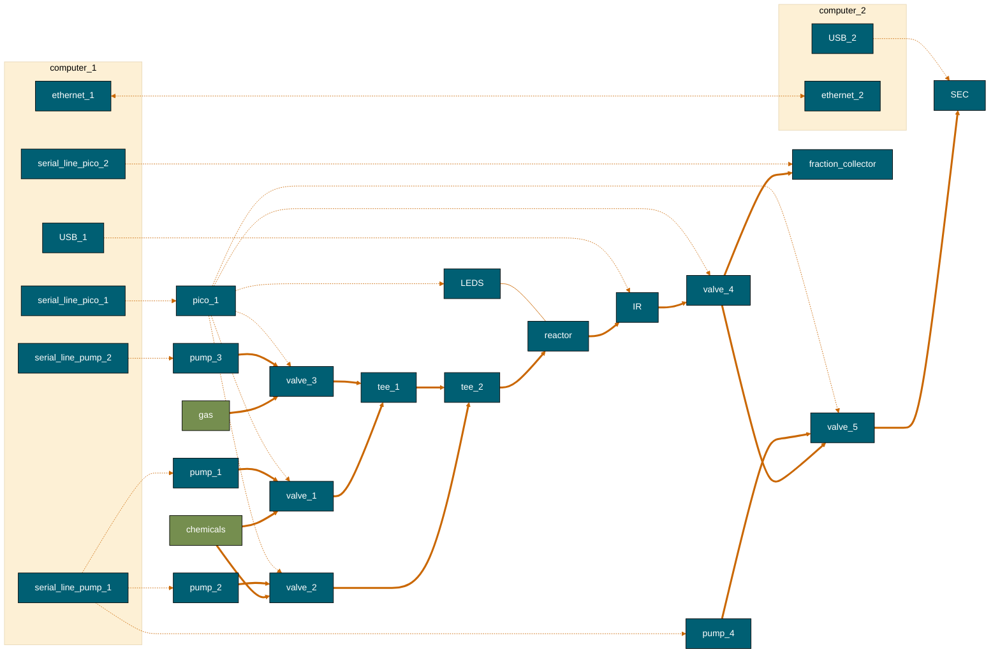
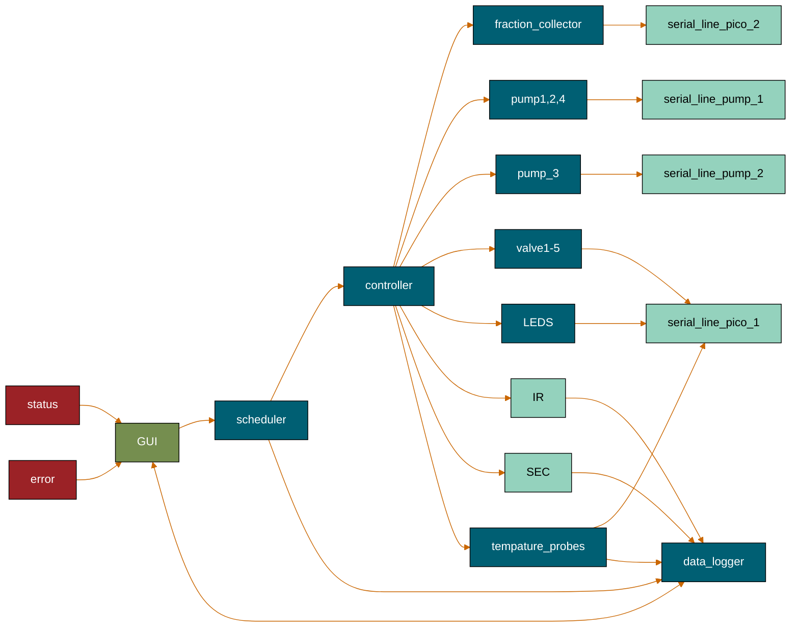

https://mermaid.js.org/config/theming.html

%%{
    init: {
    'theme':'base',
    'themeVariables': {
        'background': '#414C54',
        'fontFamily': 'arial',
        'primaryColor': '#33658A',
        'primaryTextColor': '#fff',
        'primaryBorderColor': '#000000',
        'lineColor': '#F6AE2D',
        'tertiaryColor': '#AFC5D5',
        'tertiaryTextColor': '#000000'
    }
    }
}%%

https://coolors.co/001219-005f73-0a9396-94d2bd-e9d8a6-ee9b00-ca6702-bb3e03-ae2012-9b2226  

```mermaid
%%{
    init: {
    'theme':'base',
    'themeVariables': {
        'background': '#404e4d',
        'fontFamily': 'arial',
        'primaryColor': '#005f73',
        'primaryTextColor': '#ffffff',
        'primaryBorderColor': '#000000',
        'lineColor': '#ca6702',
        'tertiaryColor': '#fdf0d5',
        'tertiaryTextColor': '#000000'
    }
    }
}%%
flowchart LR

    rabbitMQ:::rabbit    
    error:::error <--> rabbitMQ
    status:::error <--> rabbitMQ
    controller <--> rabbitMQ
    pumps <--> rabbitMQ
    valves <--> rabbitMQ
    serial_line_pump:::output <--> rabbitMQ
    serial_line_pico:::output <--> rabbitMQ
    rabbitMQ <--> LEDS
    rabbitMQ <--> IR:::output
    rabbitMQ <--> SEC:::output
    rabbitMQ <--> fraction_collector
     
    rabbitMQ <--> controller
    rabbitMQ <--> GUI:::GUI
    
    classDef rabbit fill:#001219
    classDef chem fill:#758E4F
    classDef GUI fill:#758E4F
    classDef error fill:#9b2226
    classDef output fill:#94d2bd,color:#000000
```

